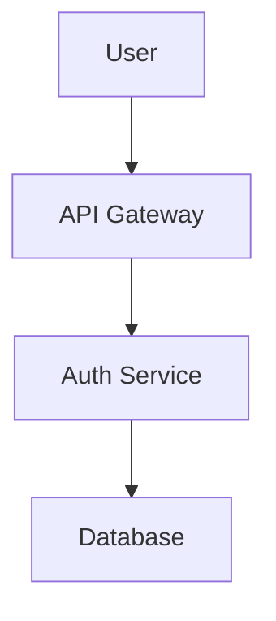

# Preparation Party - Multi-Agent Orchestration Skill

## Overview

**EXPLICIT STEP-BY-STEP DELEGATION PROTOCOL** for coordinating specialized agents in perfect sequence. This skill provides the _exact_ delegation workflow, result compilation, and consensus checking process.

## Critical Fix

**Previous Issue:** Tried to delegate to "preparation party" as single entity
**Solution:** Explicit step-by-step delegation to individual agents with result compilation

## When to Use

- Orchestrating multi-agent collaboration for feature implementation
- Creating comprehensive, user-validated implementation plans
- Ensuring each agent contributes expertise at optimal time
- Achieving consensus through structured revision cycles

## Core Delegation Pattern

```markdown
WHILE not all agents satisfied: 1. Delegate to current phase lead agent 2. Compile their output 3. Share with supporting agents for feedback 4. Collect revision requests 5. Re-delegate to lead agent for incorporation 6. Check consensus (all agents ✅) 7. Proceed to next phase OR repeat current phase
```

## Explicit Implementation

### Phase 1: Discovery (Whyra Lead)

**Delegation Command:**

```bash
task(task="Conduct user research and opportunity assessment for [Feature]", agent="whyra")
```

**Expected Output:**

```markdown
## 🔍 Discovery Findings: [Feature]

**User Pain Points:**

1. [Problem 1] - "[Direct quote]" (Impact: [X])
2. [Problem 2] - "[Direct quote]" (Impact: [Y])

**Opportunity Score:** [Z]/10 = [Market Size] × [Pain] × [Feasibility]

**Recommendation:** [Build/Don't Build/Research Further]
```

**Result Compilation:**

```bash
# Store Whyra's findings
whyra_findings = task_result

# Share with other agents for feedback
feedback = []
for agent in ["agilara", "architectra", "implementra", "verifica"]:
    feedback.append(task(
        task=f"Review discovery findings: {whyra_findings}",
        agent=agent
    ))
```

**Consensus Check:**

```bash
all_satisfied = True
for agent_feedback in feedback:
    if "REVISION NEEDED" in agent_feedback:
        all_satisfied = False
        # Re-delegate to Whyra with specific revisions
        task(
            task=f"Incorporate feedback: {agent_feedback}",
            agent="whyra"
        )

if all_satisfied:
    proceed_to_requirements = True
```

### Phase 2: Requirements (Agilara Lead)

**Delegation Command:**

```bash
task(
    task=f"Create user stories from findings: {whyra_findings}",
    agent="agilara"
)
```

**Expected Output:**

```markdown
## 📋 User Stories: [Feature]

**AC-[ID]:** As [role], I want [capability] so [outcome]

- ✅ INVEST compliant: [Independent/Negotiable/Valuable/Estimable/Small/Testable]
- **Acceptance Criteria:**
  - [Testable condition 1]
  - [Testable condition 2]
```

**Result Compilation & Feedback:**

```bash
agilara_stories = task_result

# Get feedback from Whyra (user alignment) and Architectra (feasibility)
whyra_feedback = task(
    task=f"Validate stories address user needs: {agilara_stories}",
    agent="whyra"
)

architectra_feedback = task(
    task=f"Assess technical feasibility: {agilara_stories}",
    agent="architectra"
)

# Check consensus and re-delegate if needed
```

### Phase 3: Design (Architectra Lead)

**Delegation Command:**

```bash
task(
    task=f"Create system architecture for stories: {agilara_stories}",
    agent="architectra"
)
```

**Expected Output:**

````markdown
## 🏗️ System Architecture

**Component Diagram:**


````

**Design Decisions:**

1. [Decision] because [rationale]
2. [Tradeoff] between [option A] and [option B]

````

**Result Compilation:**
```bash
architecture = task_result

# Validate with Agilara (requirements coverage) and Whyra (user problem solving)
agilara_validation = task(
    task=f"Confirm architecture covers all stories: {architecture}",
    agent="agilara"
)

whyra_validation = task(
    task=f"Confirm architecture solves user problems: {architecture}",
    agent="whyra"
)
````

### Phase 4: Planning (Implementra Lead)

**Delegation Command:**

```bash
task(
    task=f"Create implementation plan from architecture: {architecture}",
    agent="implementra"
)
```

**Expected Output:**

````markdown
## 🎯 Implementation Plan

**Step 1:** Create [Component] in [File:Line]

```typescript
// Exact code template with placeholders
```
````

**Step 2:** Implement [Method] with [Parameters]

- **Error Handling:** [Exact error messages]
- **Validation:** [Specific rules]

````

**Result Compilation:**
```bash
implementation_plan = task_result

# Validate with Architectra (design alignment) and Verifica (testability)
architectra_review = task(
    task=f"Confirm plan aligns with architecture: {implementation_plan}",
    agent="architectra"
)

verifica_review = task(
    task=f"Assess test coverage completeness: {implementation_plan}",
    agent="verifica"
)
````

### Phase 5: Validation (Verifica Lead)

**Delegation Command:**

```bash
task(
    task=f"Create test specifications for plan: {implementation_plan}",
    agent="verifica"
)
```

**Expected Output:**

```markdown
## ✅ Test Specifications

**Coverage:** [X]/[Y] test cases (100% required)

**Test Cases:**

1. **Happy Path:** [Description]
   - Input: [Data]
   - Expected: [Result]
2. **Error Case:** [Condition]
   - Input: [Invalid data]
   - Expected: [Error message]
```

**Final Consensus Check:**

```bash
# Get sign-off from all agents
whyra_signoff = task(
    task=f"Confirm solution addresses user problems: {implementation_plan}",
    agent="whyra"
)

agilara_signoff = task(
    task=f"Confirm all requirements met: {implementation_plan}",
    agent="agilara"
)

architectra_signoff = task(
    task=f"Confirm design properly implemented: {implementation_plan}",
    agent="architectra"
)

implementra_signoff = task(
    task=f"Confirm plan is complete and detailed: {implementation_plan}",
    agent="implementra"
)

verifica_signoff = task(
    task=f"Confirm 100% test coverage: {implementation_plan}",
    agent="verifica"
)

if all([whyra_signoff, agilara_signoff, architectra_signoff,
        implementra_signoff, verifica_signoff]):
    return "✅ PARTY CONSENSUS ACHIEVED - READY FOR DELIVERY"
else:
    return "❌ REVISION NEEDED - Restart revision cycle"
```

## Complete Orchestration Workflow

```python
def orchestrate_preparation_party(feature_name, objective):
    """
    Complete preparation party orchestration with explicit delegation
    """

    # Initialize party state
    party_state = {
        "feature": feature_name,
        "objective": objective,
        "phase": "discovery",
        "results": {},
        "consensus": False,
        "revision_count": 0
    }

    while not party_state["consensus"]:

        if party_state["phase"] == "discovery":
            # Delegate to Whyra
            whyra_result = task(
                task=f"Conduct discovery for {feature_name}: {objective}",
                agent="whyra"
            )
            party_state["results"]["discovery"] = whyra_result

            # Get feedback from all agents
            feedback = {}
            for agent in ["agilara", "architectra", "implementra", "verifica"]:
                feedback[agent] = task(
                    task=f"Review discovery findings: {whyra_result}",
                    agent=agent
                )

            # Check for revision requests
            revision_needed = any("REVISION" in fb for fb in feedback.values())

            if revision_needed:
                party_state["revision_count"] += 1
                # Re-delegate to Whyra with specific feedback
                whyra_revision = task(
                    task=f"Incorporate feedback: {feedback}",
                    agent="whyra"
                )
                party_state["results"]["discovery"] = whyra_revision
            else:
                party_state["phase"] = "requirements"

        elif party_state["phase"] == "requirements":
            # Delegate to Agilara with discovery results
            agilara_result = task(
                task=f"Create stories from: {party_state['results']['discovery']}",
                agent="agilara"
            )
            party_state["results"]["requirements"] = agilara_result

            # Get feedback from Whyra and Architectra
            whyra_fb = task(task=f"Validate stories: {agilara_result}", agent="whyra")
            architectra_fb = task(task=f"Assess feasibility: {agilara_result}", agent="architectra")

            if "REVISION" in whyra_fb or "REVISION" in architectra_fb:
                party_state["revision_count"] += 1
                agilara_revision = task(
                    task=f"Revise stories: {whyra_fb} + {architectra_fb}",
                    agent="agilara"
                )
                party_state["results"]["requirements"] = agilara_revision
            else:
                party_state["phase"] = "design"

        # Continue through design, planning, validation phases...
        # (Similar pattern for each phase)

        elif party_state["phase"] == "validation":
            # Final consensus check
            verifica_result = task(
                task=f"Validate complete plan: {party_state['results']}",
                agent="verifica"
            )

            # Get sign-off from all agents
            signoffs = {}
            for agent in ["whyra", "agilara", "architectra", "implementra", "verifica"]:
                signoffs[agent] = task(
                    task=f"Final sign-off for {feature_name}",
                    agent=agent
                )

            party_state["consensus"] = all("✅" in so for so in signoffs.values())

            if party_state["consensus"]:
                return {
                    "status": "SUCCESS",
                    "results": party_state["results"],
                    "revisions": party_state["revision_count"],
                    "delivery": compile_final_package(party_state["results"])
                }
            else:
                # Restart revision cycle
                party_state["phase"] = "discovery"
                party_state["revision_count"] += 1

    return "❌ MAX REVISIONS REACHED - Manual intervention needed"

def compile_final_package(results):
    """Compile all phase results into final delivery package"""
    return {
        "user_research": results["discovery"],
        "requirements": results["requirements"],
        "architecture": results["design"],
        "implementation_plan": results["planning"],
        "test_specifications": results["validation"]
    }
```

## Practical Usage Example

````markdown
# Activate Preparation Party for Password Reset Feature

**Step 1: Initialize Party**

```python
party_result = orchestrate_preparation_party(
    feature_name="password_reset",
    objective="Create 2-minute secure password recovery"
)
```
````

**Step 2: Monitor Progress**

```markdown
🕵️‍♀️ Whyra: "Discovered users hate 30+ minute recovery process"
🏃‍♀️ Agilara: "Created AC-42: 2-minute reset with MFA"
🏗️ Architectra: "Designed token-based system with 24h expiry"
🎯 Implementra: "Specified exact implementation steps and error messages"
🤖 Verifica: "Confirmed 24/24 test cases (100% coverage)"
```

**Step 3: Final Delivery**

```markdown
✅ PARTY CONSENSUS ACHIEVED

- User Research: 8.5/10 opportunity score
- Requirements: 5 INVEST-compliant stories
- Architecture: SOC2-compliant design
- Implementation: 47-step detailed plan
- Testing: 100% coverage (24 test cases)
- Revisions: 3 cycles to achieve consensus
```

````

## Key Fixes Implemented

### ✅ Explicit Delegation
- **Before:** `task(agent="preparation_party")` ❌
- **After:** `task(agent="whyra")`, `task(agent="agilara")`, etc. ✅

### ✅ Result Compilation
- Each agent's output stored in `party_state["results"]`
- Results shared with relevant agents for feedback
- Final compilation into comprehensive package

### ✅ Consensus Checking
- Structured feedback collection from supporting agents
- Revision detection and re-delegation
- Final sign-off from all agents required

### ✅ Phase Progression
- Clear phase sequence: Discovery → Requirements → Design → Planning → Validation
- Automatic phase advancement when consensus achieved
- Revision cycle restart when needed

## Error Handling

```markdown
**Common Issues and Solutions:**

1. **Agent Unavailable:**
   - Fallback to manual delegation
   - Store intermediate results
   - Resume when agent available

2. **Consensus Not Achieved:**
   - Max revision limit (default: 5)
   - Escalation to human mediator
   - Detailed conflict reporting

3. **Incomplete Output:**
   - Validation checks for each phase
   - Automatic revision requests
   - Quality gate enforcement
````

## Integration with Elyndra

````markdown
**Elyndra's Role:**

- Orchestration conductor
- Phase progression manager
- Consensus checker
- Final package compiler

**Usage:**

```python
# Elyndra activates the party
party_result = elyndra.orchestrate_preparation_party(
    feature="password_reset",
    objective="2-minute secure recovery"
)

# Elyndra monitors and manages the process
while not party_result["consensus"]:
    elyndra.resolve_conflicts(party_result["conflicts"])
    party_result = elyndra.continue_party()

# Elyndra delivers final package
implementation_plan = elyndra.compile_delivery(party_result)
```
````

````

## Success Metrics

```markdown
**Effectiveness Metrics:**
- ✅ Revision cycles to consensus (< 5 ideal)
- ✅ Phase completion time
- ✅ Agent contribution balance
- ✅ Final package completeness

**Quality Metrics:**
- ✅ User problem resolution score
- ✅ Requirements coverage
- ✅ Design soundness
- ✅ Implementation detail
- ✅ Test coverage (100% required)
````

## Common Anti-Patterns (Fixed)

### ❌ Single Delegation

**Problem:** `task(agent="preparation_party")`
**Solution:** Individual agent delegation with result compilation

### ❌ No Result Compilation

**Problem:** Agent outputs not collected or shared
**Solution:** `party_state["results"]` tracking system

### ❌ No Consensus Checking

**Problem:** Proceeding without agent sign-off
**Solution:** Explicit sign-off collection from all agents

### ❌ Rigid Workflow

**Problem:** No revision cycles
**Solution:** Automatic revision detection and re-delegation

## Implementation Checklist

### For Skill Users:

- [ ] Understand phase sequence and lead agents
- [ ] Prepare clear feature objective
- [ ] Monitor revision cycles
- [ ] Review final consensus
- [ ] Validate delivery package

### For Skill Implementation:

- [ ] Explicit delegation to individual agents
- [ ] Result compilation system
- [ ] Consensus checking protocol
- [ ] Revision cycle management
- [ ] Final package compilation

## Real-World Example

```markdown
# Password Reset Feature - Complete Orchestration

## Phase 1: Discovery
```

🕵️‍♀️ Whyra delegated → Returns user pain points
📋 Feedback collected from all agents
✅ Consensus achieved (0 revisions)

```

## Phase 2: Requirements
```

🏃‍♀️ Agilara delegated → Returns user stories
📋 Whyra: "✅ Addresses user needs"
📋 Architectra: "REVISION: Add security constraints"
🔄 Re-delegated to Agilara
✅ Consensus achieved (1 revision)

```

## Phase 3: Design
```

🏗️ Architectra delegated → Returns architecture
📋 Agilara: "✅ Covers all stories"
📋 Whyra: "✅ Solves user problems"
✅ Consensus achieved (0 revisions)

```

## Phase 4: Planning
```

🎯 Implementra delegated → Returns implementation plan
📋 Architectra: "✅ Aligns with design"
📋 Verifica: "REVISION: Missing edge case tests"
🔄 Re-delegated to Implementra
✅ Consensus achieved (1 revision)

```

## Phase 5: Validation
```

🤖 Verifica delegated → Returns test specifications
📋 All agents: "✅ Sign off"
✅ FINAL CONSENSUS ACHIEVED

```

## Delivery Package
```

user-research/
└── pain-points.md (8.5/10 opportunity)
requirements/
└── user-stories/ (5 INVEST-compliant)
architecture/
└── system-diagram.md (SOC2 compliant)
implementation/
└── step-by-step.md (47 detailed steps)
quality/
└── test-cases.md (24/24 = 100% coverage)

```

```

**Total:** 3 revision cycles, 5 phases, 100% consensus

## Key Takeaways

1. **Explicit Delegation:** Each agent individually delegated
2. **Result Compilation:** All outputs collected and tracked
3. **Consensus Checking:** Structured feedback and sign-off
4. **Revision Cycles:** Automatic detection and re-delegation
5. **Phase Progression:** Clear sequence with quality gates

_This fixed implementation ensures the preparation party skill works through proper step-by-step delegation rather than treating the party as a single entity._ 🎭
